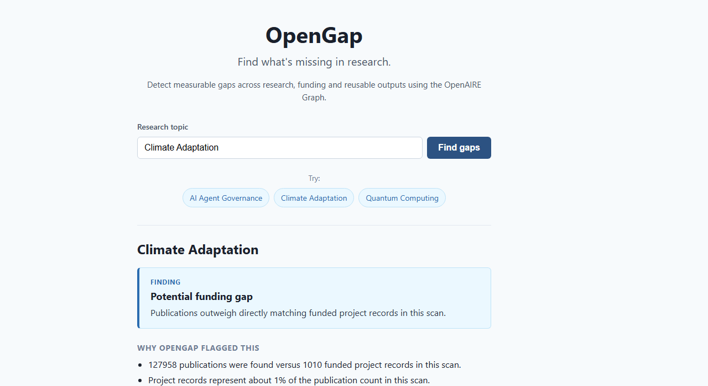

# OpenGap

**Find what's missing in research — and show the evidence.**

OpenGap turns an OpenAIRE topic search into an evidence-backed research-gap hypothesis.

- 🔎 Enter a research topic
- 📊 Compare publications, projects, software and datasets
- ⚙️ Apply deterministic gap-detection rules
- 🔗 Inspect the OpenAIRE evidence behind every finding

**[Try the live demo →](https://11-open-gap.vercel.app/)**

Demo topics: `AI Agent Governance` · `Climate Adaptation` · `Quantum Computing`



## Example

### Climate Adaptation

**Potential funding gap**

Publications outweigh directly matching funded project records in this scan.

| Signal | Value |
|---|---:|
| Publications | 127,958 |
| Projects | 1,010 |
| Software | 402 |
| Datasets | 6,015 |
| Projects / publications | ~1% |

OpenGap does not claim this proves a research gap. It identifies a measurable
imbalance worth investigating and links the result back to OpenAIRE evidence.

## Why OpenAIRE makes this possible

Traditional literature search mostly answers:

> What has been published?

OpenAIRE lets OpenGap ask a different question:

> How does publication activity compare with funding, software and
> reusable datasets around the same topic?

OpenAIRE aggregates publications, funded projects, software and datasets into
one Graph, so a single topic scan can compare how research is published,
funded and translated into reusable outputs from one source of record. That
cross-entity view is the core signal OpenGap uses — not another paper search.

## How it works

```text
Browser
   │
   ▼
Next.js
   │
   ├── /api/analyze
   │       │
   │       ▼
   │   OpenAIRE Graph API v3
   │
   ▼
Deterministic gap rules
   │
   ▼
AnalysisResult + evidence
```

OpenGap is one small Next.js (App Router) application. There is no database
and no separate backend service; the server-side `/api/analyze` route calls
OpenAIRE Graph API V3 and returns a stable `AnalysisResult` contract.

## Why this is not another research chatbot

- The core finding is **deterministic code**, not an LLM judgment.
- Measured values are shown next to the finding.
- Evidence records remain inspectable and link to their source.
- Missing provider data is never converted to `0`, and no finding is generated when OpenAIRE is unavailable.
- Evidence URLs are restricted to safe `http`/`https` links.
- The product says **potential gap** — a signal worth investigating, not proof that a field is novel or fundable.

## Methodology

Gap detection follows `docs/07-gap-detection-rules.md`. In short:

- `reusable_outputs = software + datasets`
- `translation_ratio = reusable_outputs / publications`
- Rule order: sparse evidence (too little data) → potential project/funding signal → potential reuse signal → no strong gap.
- Trend compares the two most recent complete years against the two preceding ones (growing / stable / declining / insufficient data).
- At most three human-readable reasons are templated from the measured values.

## Limitations

Search-count heuristics are topic- and query-dependent and are **not** scientometric proof. OpenGap is designed to surface signals for further investigation, not to prove scientific novelty, funding quality, unmet societal need, or commercial value. OpenAIRE metadata coverage and query wording directly affect every count. A detected signal is a flag to investigate further; it does not claim to prove a gap exists.

## Run locally

```bash
npm install
npm run dev
```

Optional environment variables are described in `.env.example` (an OpenAIRE API token is not required for the demo).

## Validate

```bash
npm run lint
npm run test
npm run build
```

## Demo & reproducibility

The three homepage examples are covered by golden demo contract tests. Live
OpenAIRE data remains authoritative, so exact counts — and even which gap
type is flagged — can change between runs. The [Example](#example) above
(Climate Adaptation, captured 2026-08-20) shows one real run end to end.

OpenGap never fabricates results when OpenAIRE is unavailable: the API
returns a structured `OPENAIRE_UNAVAILABLE` error instead of a stack trace
or a silent zero.

More screenshots: [`submission/screenshots/`](submission/screenshots/)

## Next steps (post-hackathon)

Field-aware baselines, geographic/institutional graph signals, richer funding relationships, and evidence-backed facet exploration are intentionally left for later work.

## License

Submission documentation (this README, `docs/`, `submission/`) is under CC BY 4.0 — see `LICENSE.md`. No separate license has been selected for the source code yet.
